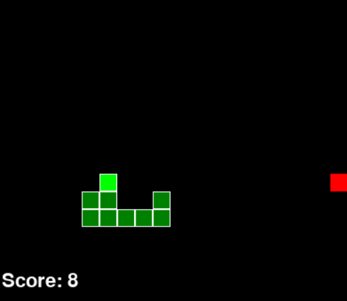
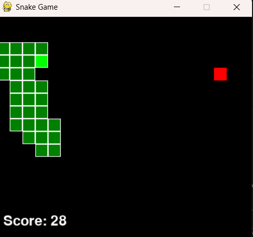
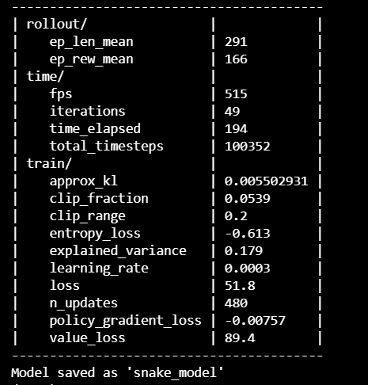

# 🐍 Snake Game with Reinforcement Learning

A modular implementation of the classic Snake game where a reinforcement learning agent learns to play the game autonomously.

The project uses **Gymnasium** to create the Snake environment and **Stable-Baselines3 (PPO)** to train the reinforcement learning model.

## 📸 Screenshots

### 🎮 Manual Gameplay



### 🤖 AI Playing Snake



### 📈 Training Progress



## 📁 Project Structure

```text
├── snake_game.py      # Core game logic + manual play
├── snake_env.py       # Gymnasium environment wrapper
├── train_snake.py     # Training script with SB3
├── pyproject.toml     # Project configuration and dependencies
└── README.md          # Project documentation